# Docker Node.js CI/CD Project

## Overview
This project demonstrates a complete CI/CD pipeline for a simple Node.js application using Docker. The pipeline builds the Docker image locally, pushes it to Docker Hub, AWS ECR, and GCP Artifact Registry, and automates the process using GitHub Actions.

## Application
- A simple Node.js Express application running on port 3000.
- Responds with "Hello World from Docker!" on the root endpoint.

**Implementation**


## Step 1: Set Up the Node.js Application
1. I Created project folder and initialized Node.js project:
   ```bash
   mkdir docker-node-app
   cd docker-node-app
   npm init -y
   npm install express
   ```
2. I Created `app.js` with Express server running on port 3000.

### I added Screenshots


## Step 2: Write a Dockerfile
1. I Created `Dockerfile` with Node.js base image, copied dependencies, and exposed port 3000.
2. I Built the Docker image locally:
   ```bash
   docker build -t docker-node-app .
   ```
3. I Tested the container locally:
   ```bash
   docker run -p 3000:3000 docker-node-app
   ```

### I added Screenshots
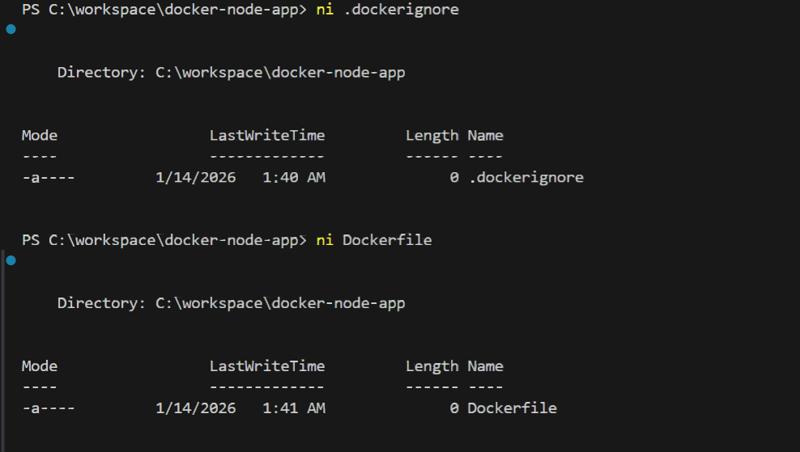
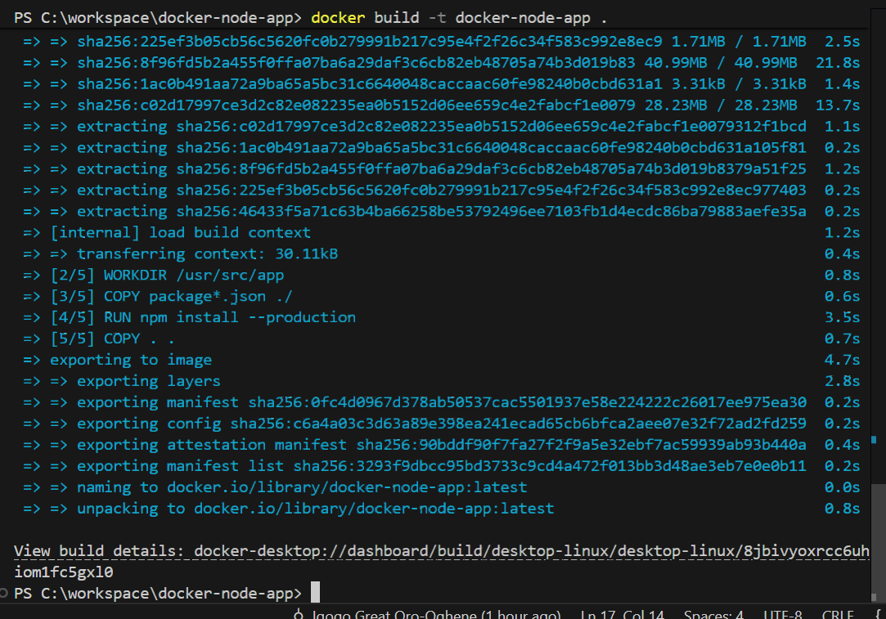
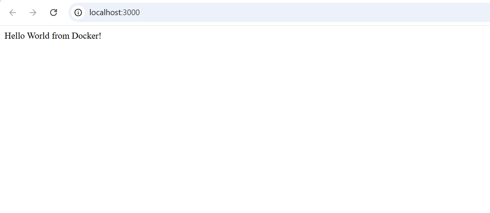


## Step 3: Push to Docker Hub
1. I Logged in to Docker Hub:
   ```bash
   docker login
   ```
2. I Tagged the image:
   ```bash
   docker tag docker-node-app bigoronaa/docker-node-app:latest
   ```
3. I Pushed to Docker Hub:
   ```bash
   docker push bigoronaa/docker-node-app:latest
   ```


### I added Screenshots
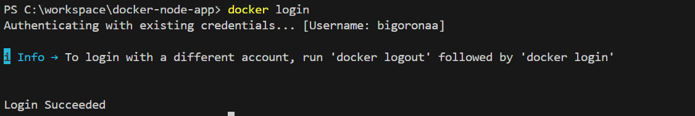
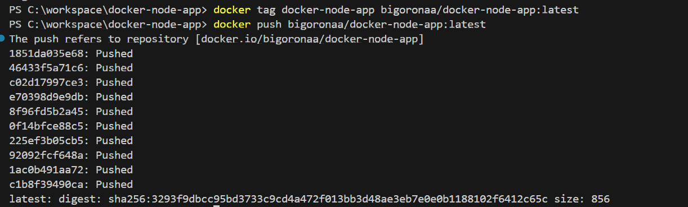
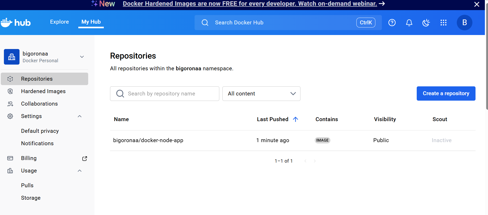


## Step 4: Push to AWS ECR
1. I Created ECR repository `docker-node-app` on AWS.
2. I Logged in to ECR:
   ```bash
   aws ecr get-login-password --region us-east-1 | docker login --username AWS --password-stdin 149790123077.dkr.ecr.us-east-1.amazonaws.com
   ```
3. I Tagged and pushed the image to ECR:
   ```bash
   docker tag docker-node-app:latest 149790123077.dkr.ecr.us-east-1.amazonaws.com/docker-node-app:latest
   docker push 149790123077.dkr.ecr.us-east-1.amazonaws.com/docker-node-app:latest
   ```

### I added Screenshots

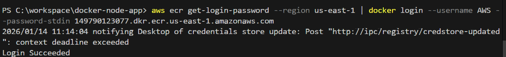
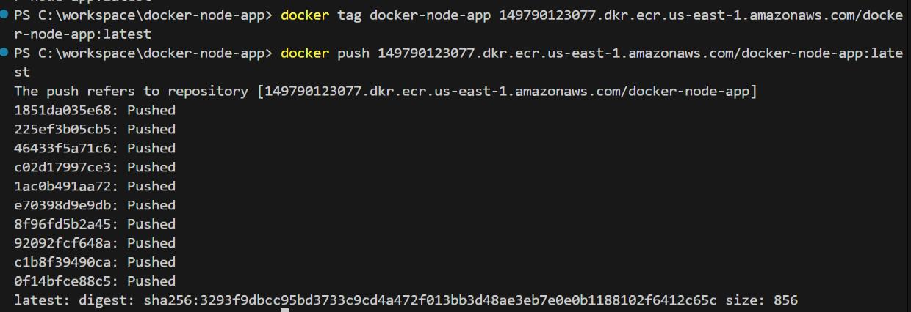


## Step 5: Push to GCP Artifact Registry
1. I Configured Artifact Registry repository `docker-node-app` in `us-central1`.
2. I Initially, JSON key creation was blocked by organization policy, so I used Workload Identity Federation setup.
3. I Tagged the Docker image:
   ```bash
   docker tag docker-node-app:latest us-central1-docker.pkg.dev/project-525a47ad-8a94-41ce-85d/docker-node-app/docker-node-app:latest
   ```
4. I Pushed to GCP Artifact 

### I added Screenshots
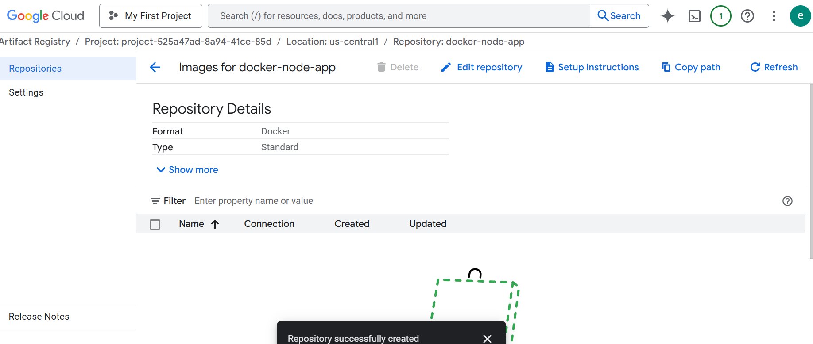
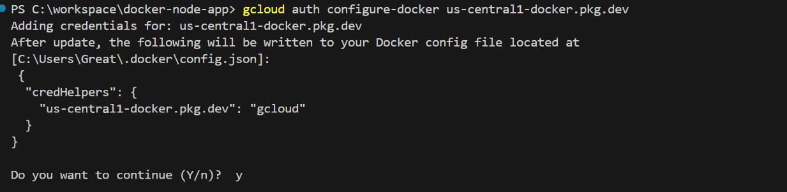
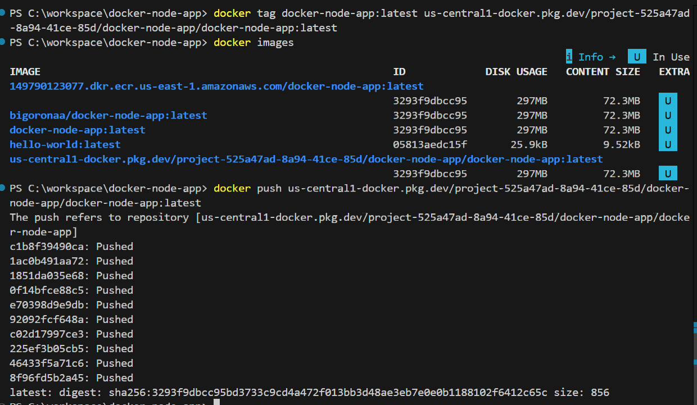
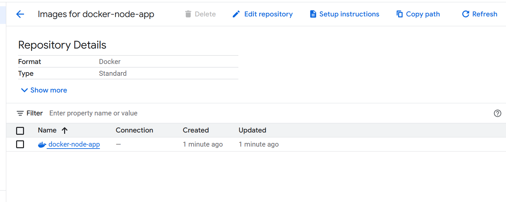


## Step 6: Automate the Process with GitHub Actions
1. Created `.github/workflows/docker-publish.yml`:
   - Checked out code.
   - Set up Docker Buildx.
   - Built Docker image.
   - Pushed to Docker Hub.
   - Pushed to AWS ECR.
   I did not push to GCP because i was not able to create a JSON key for the credentials.
2. Used GitHub repository secrets for authentication to each registry.

### I added Screenshots
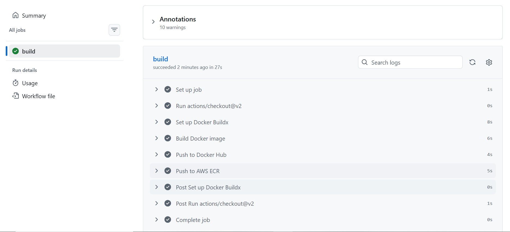
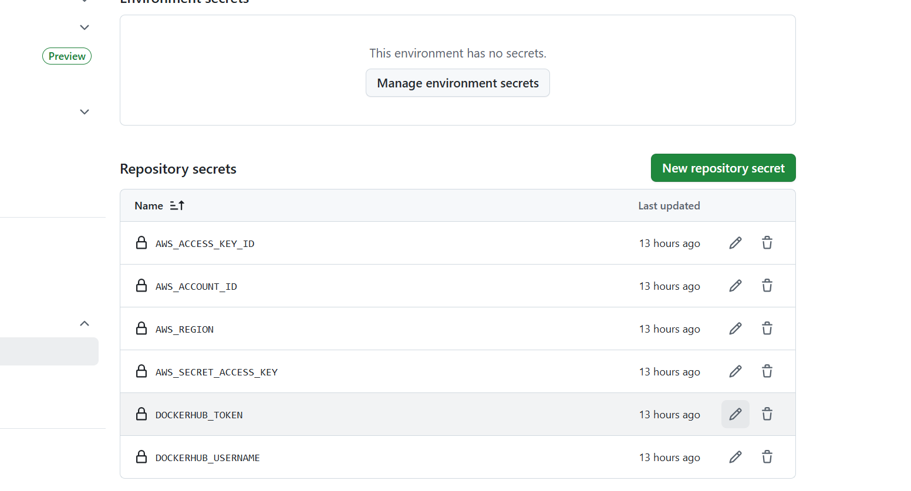

**Encountered GCP push error due to missing OIDC token injection (workflow permissions needed).**

### I added Screenshots
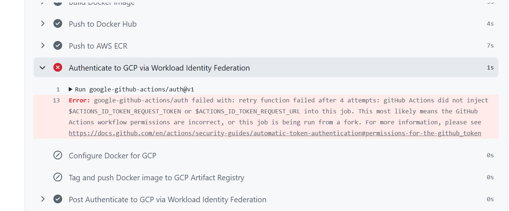

---

## Project Repository

You can find the complete source code for this project in the GitHub repository:

[https://github.com/BigOronaa/docker-node-app](https://github.com/BigOronaa/docker-node-app)


