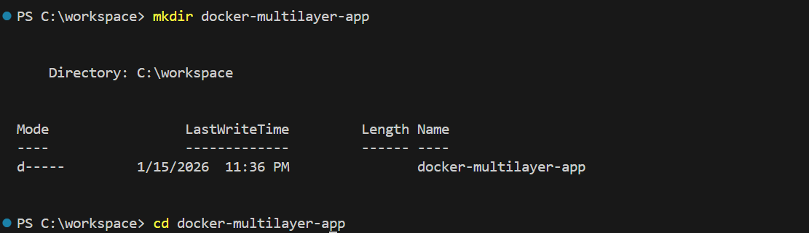
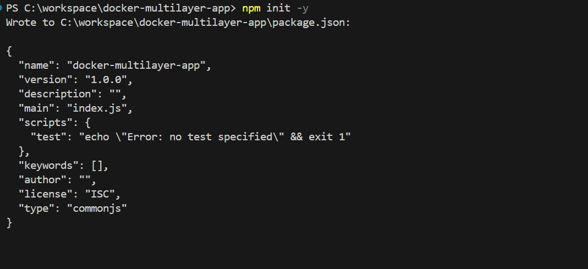
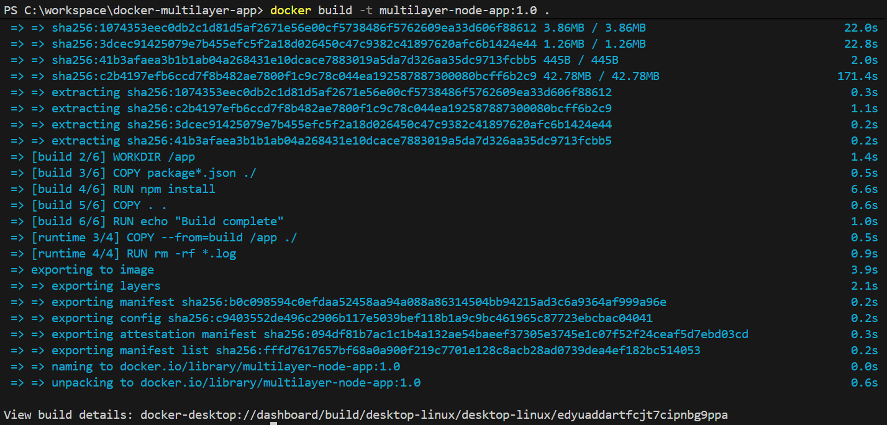
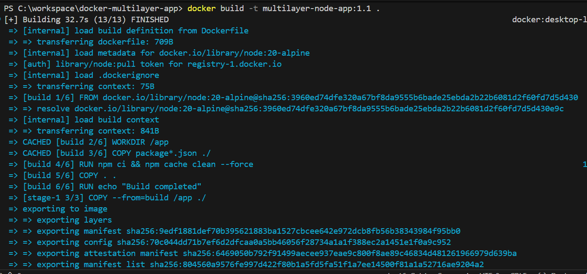
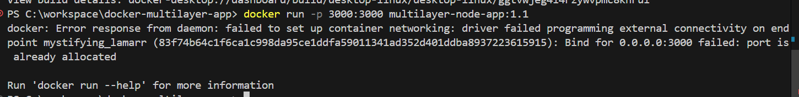
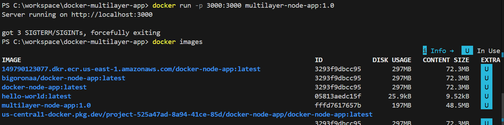

# Creating a Multilayer Dockerfile for Small Image Size


## Project Overview
In this project, I implemented a **multilayer (multistage) Dockerfile** to optimize Docker image size while following industry best practices. The goal was not only to reduce image size where possible, but also to demonstrate correct Dockerfile structure, dependency separation, security awareness, and proper testing.


---

## Project Objective
The main objective of this project was to:

- Write a multilayer Dockerfile
- Use a lightweight base image
- Separate build-time and runtime dependencies
- Apply Docker image optimization techniques
- Ensure container security best practices
- Version and tag Docker images correctly
- Build, run, and validate the Docker image
- Document results clearly

---

## Step 1: Project Setup

I started by creating a new project directory for the application:

```bash
mkdir docker-multilayer-app
cd docker-multilayer-app
```

### I added Screenshots


I initialized a Node.js application:

```bash
npm init -y
```

### I added Screenshots


Then I installed Express to create a simple web server:

```bash
npm install express
```

I created an `app.js` file with a basic HTTP endpoint that listens on port 3000.

---

## Step 2: Creating .dockerignore

To prevent unnecessary files from being copied into the Docker image, I created a `.dockerignore` file:

```
node_modules
npm-debug.log
.git
```

This helps reduce image size and improves build performance.

---

## Step 3: Writing the Initial Multilayer Dockerfile

I created a Dockerfile using a **multistage build approach**.

### Build Stage
- Used an Alpine-based Node.js image
- Installed all dependencies
- Prepared the application

### Runtime Stage
- Used a clean Alpine-based Node.js image
- Copied only required runtime files
- Ran the application as a non-root user

This separation ensures that build tools are excluded from the final runtime image.

---

## Step 4: Building and Running Version 1.0

I built the initial image:

```bash
docker build -t multilayer-node-app:1.0 .
```

### I added Screenshots


Then I ran the container:

```bash
docker run -p 3000:3000 multilayer-node-app:1.0
```

The application worked correctly and was accessible via the browser.

### I added Screenshots


---

## Step 5: Optimization Iterations and Versioning

I made incremental improvements and tagged new versions:

- `multilayer-node-app:1.1`
- `multilayer-node-app:2.0`

Each version applied Docker best practices such as:
- Layer caching
- Dependency management using `npm ci`
- Production-only dependency installation
- Security hardening

### I added Screenshots


---

## Step 6: Port 3000 Error and Resolution

While running multiple versions of the image, I encountered the following error:

```
Bind for 0.0.0.0:3000 failed: port is already allocated
```

### Cause
The error occurred because **port 3000 was already in use** by a previously running container.

### Resolution
Instead of stopping the existing container, I mapped the new container to a different host port:

```bash
docker run -p 3001:3000 multilayer-node-app:1.1
```

This allowed me to:
- Run multiple versions simultaneously
- Compare functionality
- Validate optimization without downtime

### I added Screenshots


---

## Step 7: Image Size Analysis

I compared image sizes using:

```bash
docker images
```

All optimized versions had similar sizes.

### Explanation
This was expected because:
- The application has minimal dependencies
- No compilation or heavy build artifacts exist
- The Alpine-based Node.js image is already lightweight

This demonstrated an important Docker principle:

> Image optimization effectiveness depends on the application type and build complexity.

### I added Screenshots


---

## Step 8: Security Considerations

Throughout the project, I applied container security best practices:
- Used a minimal Alpine base image
- Ran the application as a non-root user
- Avoided hard-coded secrets
- Reduced attack surface by excluding build tools

---

## Step 9: Testing and Validation

I validated the project by:
- Building images locally
- Running containers successfully
- Resolving port conflicts correctly
- Verifying application accessibility
- Comparing image sizes across versions

All containers worked as expected.

---

## Conclusion

This project successfully demonstrates how to design and implement a multilayer Dockerfile using best practices. Although the image size reduction was minimal due to the simplicity of the application, the project achieved its primary goal of **correct Docker optimization, structure, and validation**.

The project highlights that:
- Multistage builds are context-dependent
- Optimization is not only about size, but correctness
- Understanding Docker internals is essential for real-world DevOps work

---


## Project Repository

You can find the complete source code for this project in the GitHub repository:

[https://github.com/BigOronaa/docker-multilayer-app](https://github.com/BigOronaa/docker-multilayer-app)