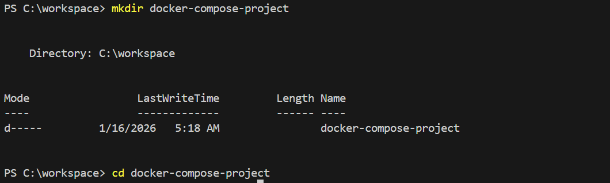
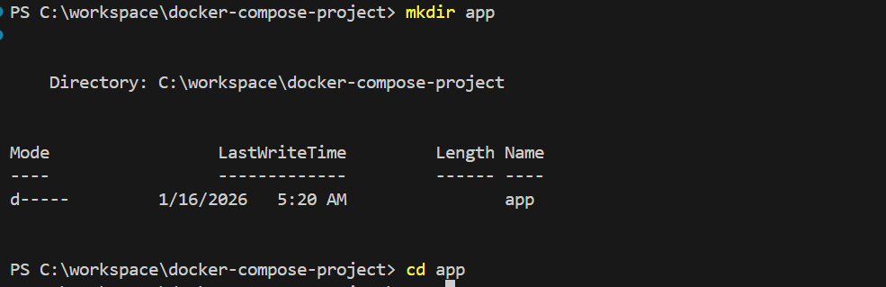
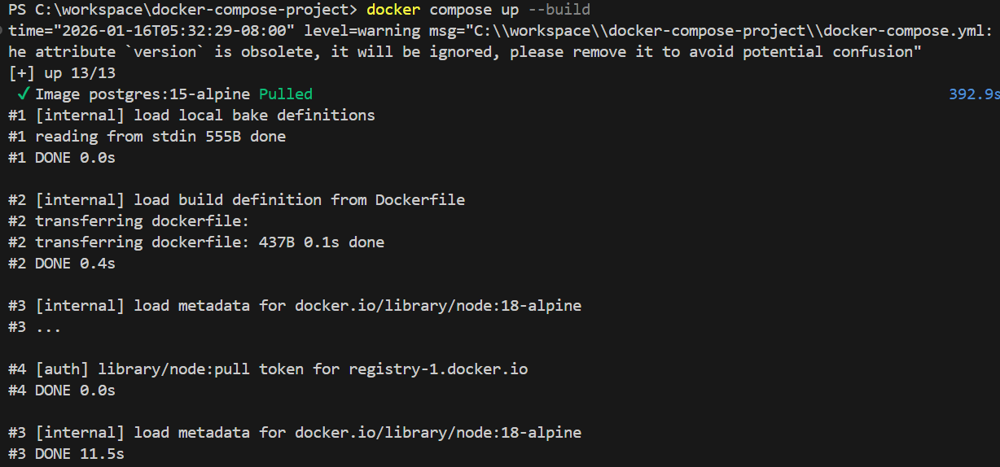
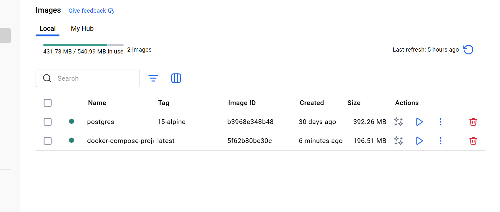
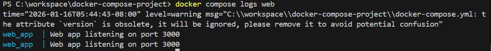
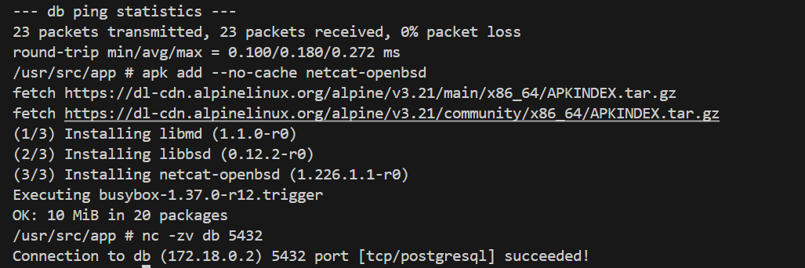
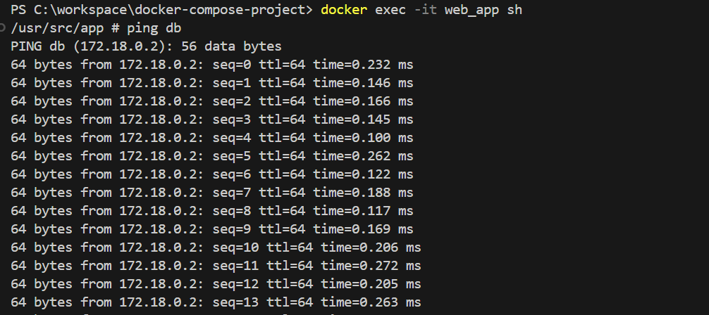
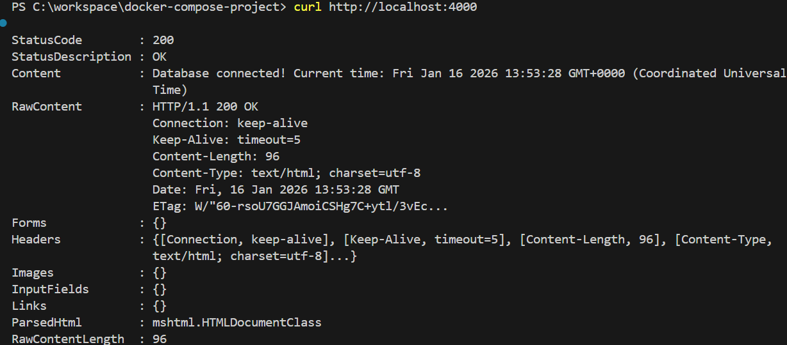
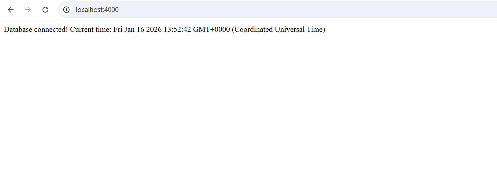
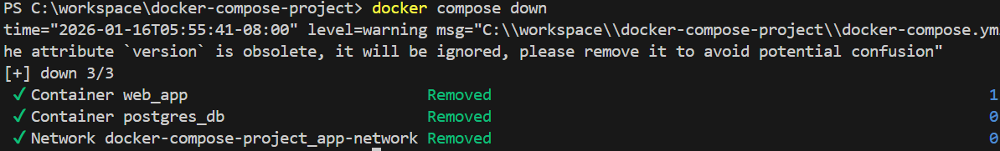

# Docker Compose for Web Application and Database Deployment

## 1. Introduction

In this project, I implemented a multi-container application using Docker Compose. The goal was to deploy a simple Node.js web application alongside a PostgreSQL database, validate container networking, inspect logs, and clean up resources after testing.

This project demonstrates practical DevOps skills such as container orchestration, service dependency management, networking, and debugging.

## 2. Project Objectives

- I carried out this project to:

- Deploy a web application and database using Docker Compose

- Practice writing Dockerfiles for application containers

- Understand container-to-container networking

- Validate application-to-database connectivity

- Inspect logs and troubleshoot warnings

- Perform proper cleanup after deployment

## 3. Project Structure

I organized the project as follows:
```
docker-compose-project/
│
├── app/
│   ├── Dockerfile
│   ├── app.js
│   ├── package.json
│   └── package-lock.json
│
└── docker-compose.yml
```


The separation of concerns made the project easier to manage and understand.

### I added Screenshots




## 4. Web Application Setup

I created a simple Node.js application using Express. The application listens on port 3000 and connects to a PostgreSQL database using environment variables provided by Docker Compose.

To containerize the application, I wrote a Dockerfile that:

- Uses a lightweight node:18-alpine base image

- Sets a working directory inside the container

- Copies dependency files first to leverage Docker layer caching

- Installs only production dependencies

- Copies the application source code

- Exposes port 3000

- Starts the application using node app.js

### I added Screenshots


## 5. Docker Compose Configuration

I defined the application stack in a docker-compose.yml file with two services:

- Web Service

- Built from the Dockerfile inside the app directory

- Exposes port 3000 internally and maps it to port 4000 on the host to avoid port conflicts

- Uses environment variables to connect to the database

- Depends on the database service

- Database Service

- Uses the postgres:15-alpine image for a smaller footprint

- Initializes a PostgreSQL database using environment variables

- Stores data in a named Docker volume for persistence

- Is accessible only within the Docker network

Docker Compose automatically created a custom bridge network that allowed the services to communicate using service names.


## 6. Deployment Process

I deployed the application stack using:
```bash
docker compose up --build
```

**Docker Compose successfully:**

- Built the web application image
- Pulled the PostgreSQL image
- Created a custom network
- Created a persistent volume
- Started both containers


### I added Screenshots



I verified that the containers were running using:
```bash
docker compose ps
```


## 7. Logs Inspection

- I checked the logs of both services to ensure there were no critical issues:
```bash
docker compose logs web
docker compose logs db
```

### I added Screenshots



- During database startup, I observed locale warnings due to the Alpine image. These warnings did notv affect functionality and are expected in minimal images.

## 8. Networking Validation

- To validate container networking, I executed a shell inside the web container:
```bash
docker exec -it web_app sh
```
- I confirmed DNS-based service discovery by pinging the database service:
```sh
ping db
```
- I then verified database port connectivity using netcat:
```sh
nc -zv db 5432
```

Both tests succeeded, confirming that the web application could reach the database over the Docker network.


### I added Screenshots




## 9. Application Testing
- I tested the application by sending an HTTP request to the exposed host port:
- curl http://localhost:4000
- The application returned a successful response confirming database connectivity:
- Database connected! Current time: <timestamp>
This validated end-to-end functionality of the deployment.


### I added Screenshots




## 10. Cleanup

After completing testing and validation, I cleaned up the environment using: docker compose down
This stopped and removed the containers and network. I preserved volumes unless explicitly removed using:
docker compose down -v


### I added Screenshots


## Conclusion

 Through this project, I successfully demonstrated how to deploy and manage a multi-container application using Docker Compose. I validated networking, application functionality, and database connectivity while following DevOps best practices for structure, logging, and cleanup.


 ## Project Repository

You can find the complete source code for this project in the GitHub repository:

[https://github.com/BigOronaa/docker-compose-project](https://github.com/BigOronaa/docker-compose-project)

