# Building a Dockerized Node.js CI/CD Pipeline

## Project Overview

This project demonstrates a complete CI/CD workflow for containerizing and distributing a Node.js application using Docker, GitHub Actions, AWS ECR, Docker Hub, and GCP Artifact Registry.

The goal of the project was to automate the container build and image distribution process across multiple container registries while implementing secure authentication workflows and improving deployment consistency.

The project also provided hands-on experience troubleshooting real-world CI/CD authentication and cloud registry integration issues.

---

# Architecture Overview

The deployment pipeline consists of:

- A containerized Node.js Express application
- Docker image build automation
- Multi-registry image publishing
- GitHub Actions CI/CD workflows
- Secure registry authentication using GitHub Secrets
- AWS ECR integration
- Docker Hub integration
- GCP Artifact Registry integration

Container registries used:
- Docker Hub
- AWS Elastic Container Registry (ECR)
- GCP Artifact Registry

---

# Application Overview

The application is a lightweight Node.js Express service running on port `3000`.

The service exposes a simple endpoint:

```bash
GET /
```

Response:

```bash
Hello World from Docker!
```

---

# Repository Structure

```bash
docker-node-app/
├── app.js
├── package.json
├── Dockerfile
├── .github/
│   └── workflows/
│       └── docker-publish.yml
└── README.md
```

---

# Application Setup

## Node.js Application Initialization

The project was initialized as a Node.js application using Express.

### Commands Used

```bash
mkdir docker-node-app
cd docker-node-app
npm init -y
npm install express
```

The application server was configured to listen on port `3000`.

### Screenshots

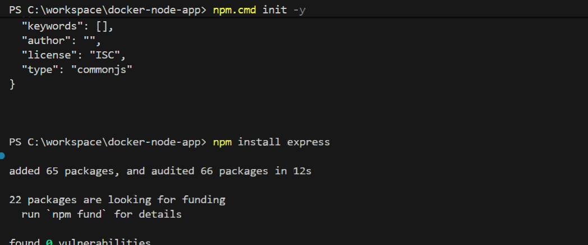

---

# Docker Containerization

## Dockerfile Configuration

A Dockerfile was created to:
- Use an official Node.js base image
- Copy application files
- Install dependencies
- Expose port `3000`
- Start the Express application

## Local Image Build

The Docker image was built locally using:

```bash
docker build -t docker-node-app .
```

## Local Container Testing

The container was tested locally using:

```bash
docker run -p 3000:3000 docker-node-app
```

This verified:
- Successful image creation
- Container startup
- Application accessibility

### Screenshots

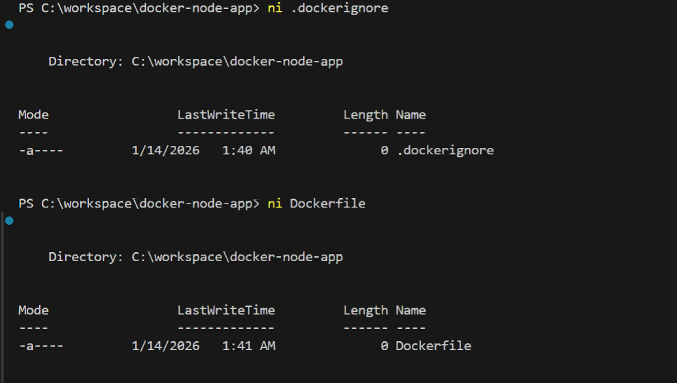

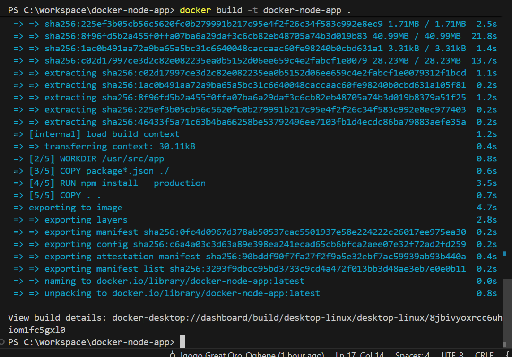

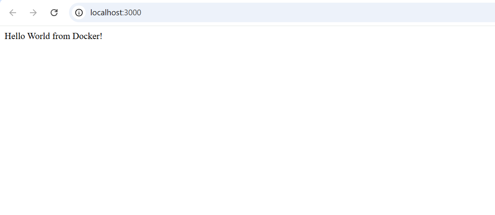

---

# Docker Hub Integration

## Image Publishing to Docker Hub

The image was tagged and pushed to Docker Hub for centralized image distribution.

### Commands Used

```bash
docker login

docker tag docker-node-app bigoronaa/docker-node-app:latest

docker push bigoronaa/docker-node-app:latest
```

This enabled:
- Public image hosting
- Simplified image distribution
- Reusable container deployments

### Screenshots

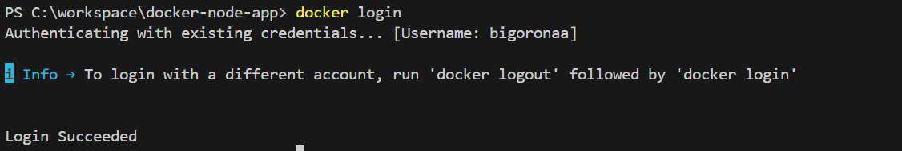

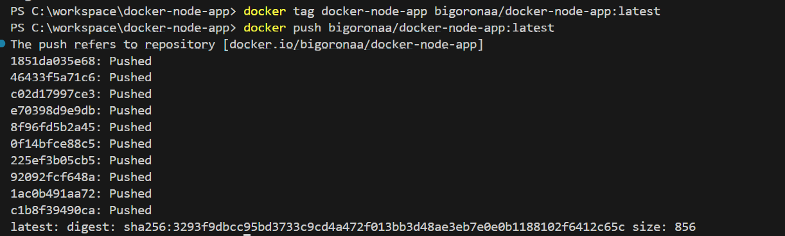

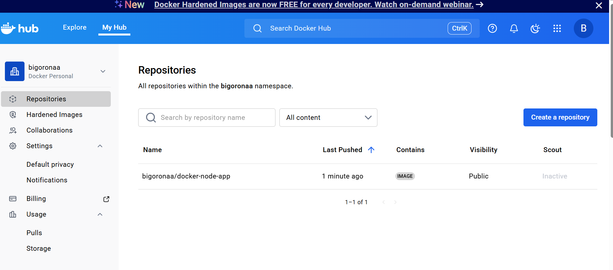

---

# AWS ECR Integration

## AWS Elastic Container Registry Configuration

An AWS ECR repository was created to host container images within AWS infrastructure.

Authentication was performed using AWS CLI-generated login credentials.

### AWS ECR Authentication

```bash
aws ecr get-login-password --region us-east-1 | docker login --username AWS --password-stdin 149790123077.dkr.ecr.us-east-1.amazonaws.com
```

## Image Tagging and Push

```bash
docker tag docker-node-app:latest 149790123077.dkr.ecr.us-east-1.amazonaws.com/docker-node-app:latest

docker push 149790123077.dkr.ecr.us-east-1.amazonaws.com/docker-node-app:latest
```

This enabled:
- Private registry storage
- Cloud-native image management
- AWS-native deployment workflows

### Screenshots

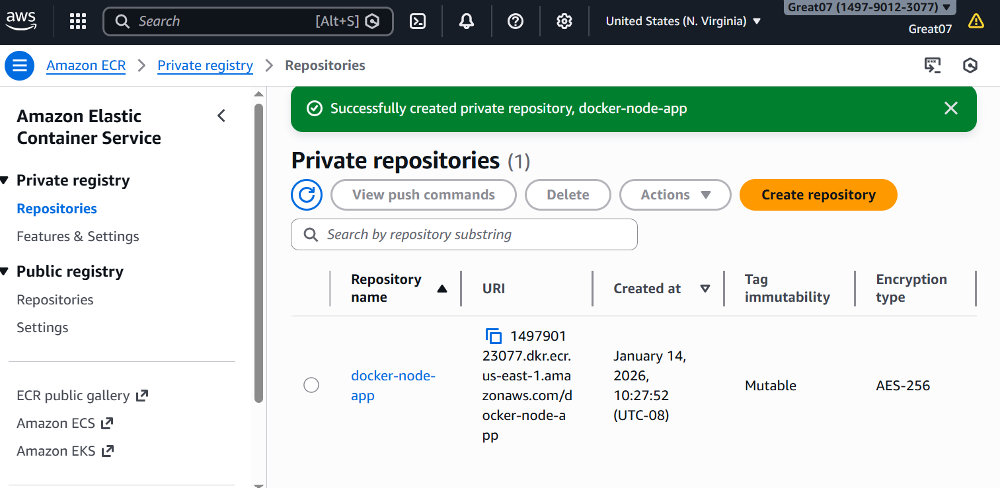

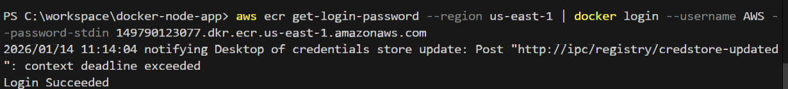

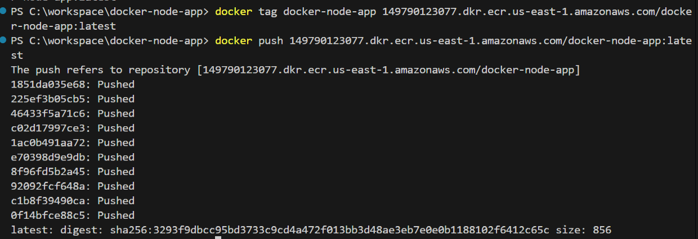

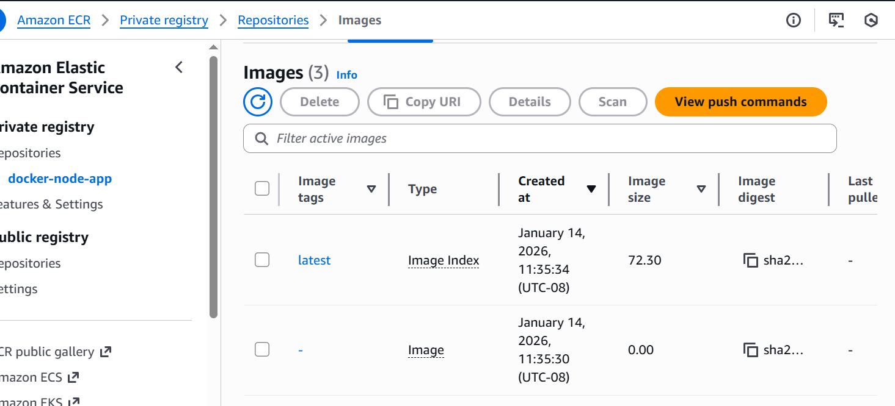

---

# GCP Artifact Registry Integration

## Artifact Registry Setup

A GCP Artifact Registry repository was configured in the `us-central1` region.

Due to organization security restrictions preventing JSON key creation, Workload Identity Federation was explored as an alternative authentication mechanism.

## Image Tagging

```bash
docker tag docker-node-app:latest us-central1-docker.pkg.dev/project-525a47ad-8a94-41ce-85d/docker-node-app/docker-node-app:latest
```

## Authentication Challenge

During CI/CD integration, image publishing to GCP Artifact Registry failed because GitHub Actions required proper OIDC token injection and workload identity configuration.

This introduced practical exposure to:
- Cloud identity federation
- OIDC authentication
- Secure CI/CD authentication patterns

### Screenshots

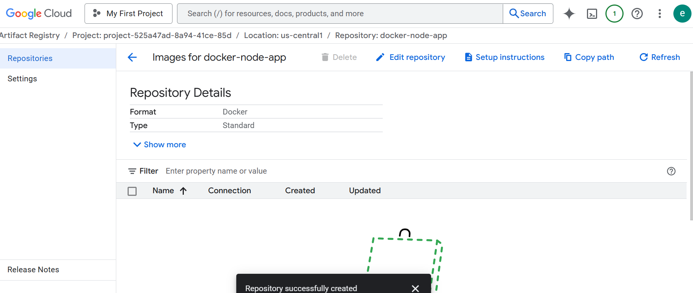

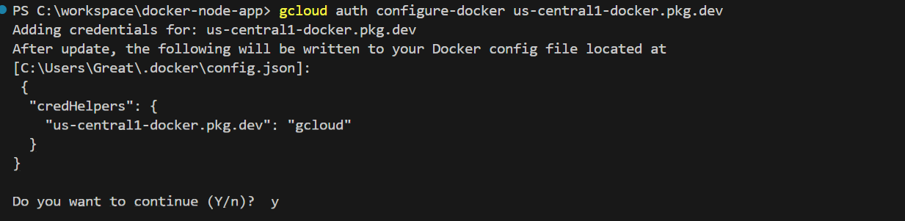

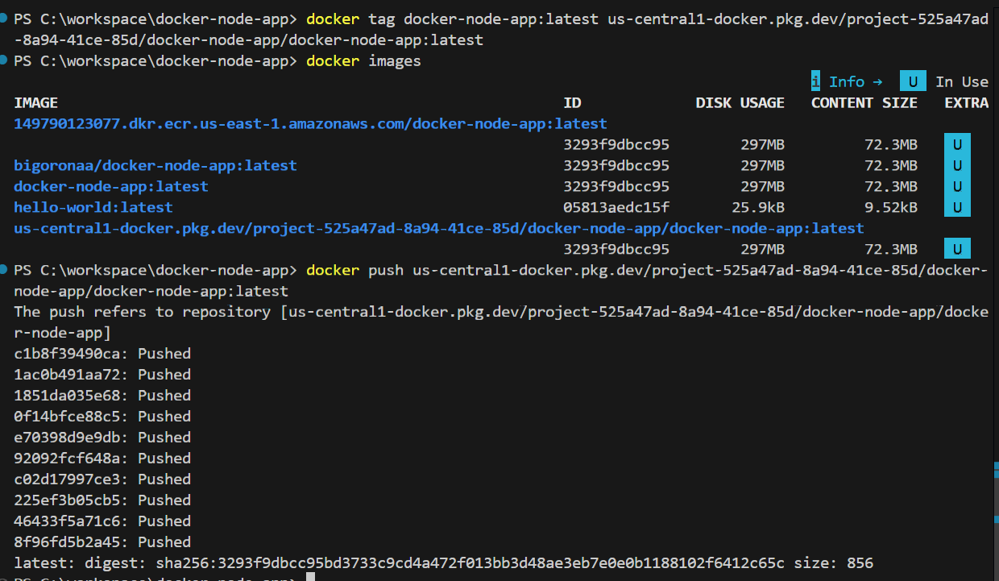

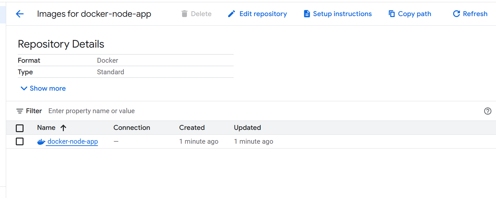

---

# CI/CD Automation with GitHub Actions

## Workflow Design

GitHub Actions was used to automate:
- Source code checkout
- Docker image builds
- Multi-registry image publishing
- Registry authentication

The workflow:
- Configured Docker Buildx
- Built Docker images automatically
- Published images to Docker Hub
- Published images to AWS ECR
- Used GitHub Secrets for secure credential management

## Workflow File

```bash
.github/workflows/docker-publish.yml
```

### Screenshots

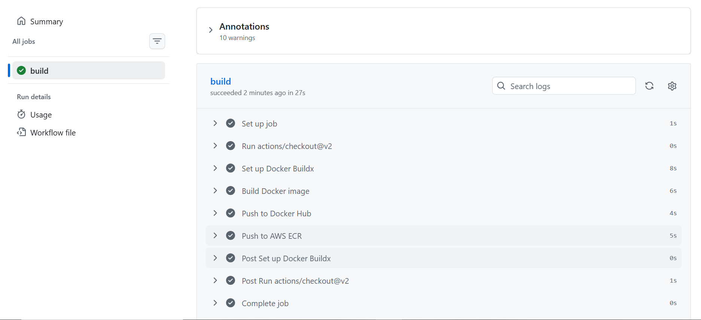

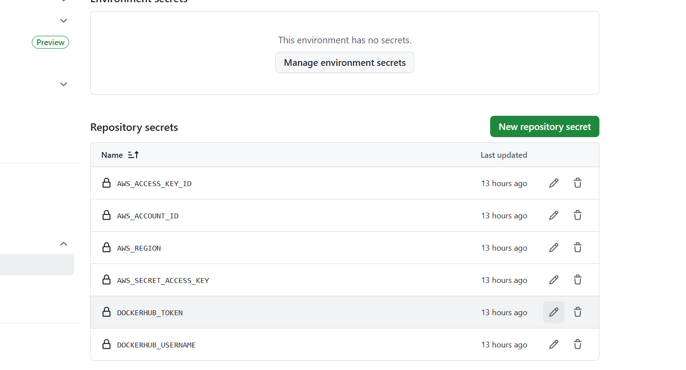

---

# Troubleshooting and Incident Resolution

## GCP Authentication Failure

### Issue

Image publishing to GCP Artifact Registry failed due to missing OIDC token injection and workload identity permissions.

### Root Cause

The GitHub Actions workflow lacked:
- Required OIDC permissions
- Workload Identity Federation configuration
- Proper token exchange setup

### Resolution

The issue was investigated by:
- Reviewing GitHub Actions authentication permissions
- Validating Artifact Registry authentication configuration
- Exploring workload identity authentication patterns

Although the GCP push remained incomplete, the troubleshooting process improved understanding of:
- Cloud-native CI/CD authentication
- Federated identity management
- Secure registry authentication workflows

### Screenshots

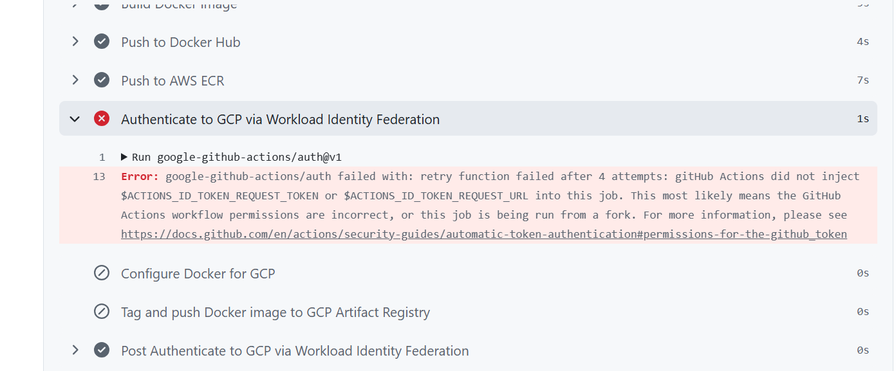

---

# Validation and Testing

Validation steps included:
- Local container execution
- Registry image verification
- GitHub Actions workflow execution
- Docker image accessibility checks
- Multi-registry image validation

Commands used during validation:

```bash
docker ps

docker images
```

---

# Key Outcomes

By completing this project, I successfully:

- Built and containerized a Node.js application using Docker
- Automated Docker image builds using GitHub Actions
- Implemented multi-registry image publishing workflows
- Integrated AWS ECR and Docker Hub into CI/CD pipelines
- Explored GCP Artifact Registry authentication using Workload Identity Federation
- Improved understanding of secure CI/CD authentication workflows
- Diagnosed and troubleshot real-world cloud registry integration issues

---

# Technologies Used

- Node.js
- Express.js
- Docker
- GitHub Actions
- AWS ECR
- GCP Artifact Registry
- Docker Hub
- GitHub Secrets

---

# Repository

GitHub Repository:

```bash
https://github.com/BigOronaa/docker-node-app
```
